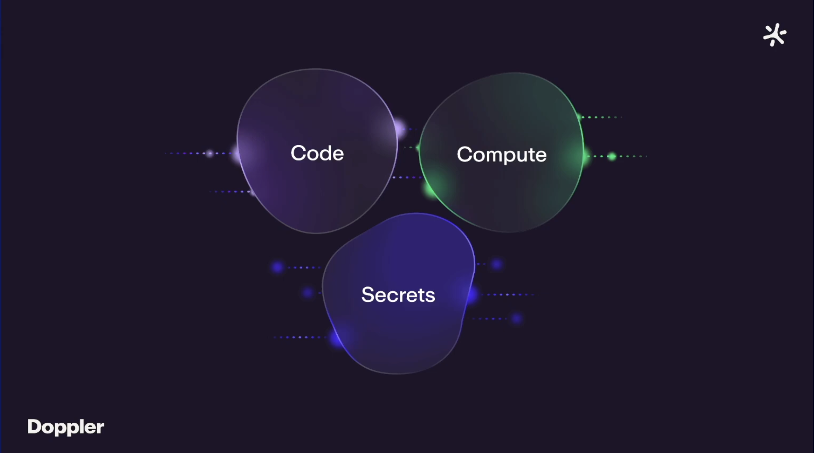

# Introduction to the aggrik8s-cluster platform
This project provisions meshed Kubernetes clusters ready to deploy to the Edge.
Terraform provisions the platform infrastructure while both Ansible and Terraform are used for`Day 2 applications` such as Observability. 
The purpose of the project is to enable development of IoT applications hosted across multiple Edge sites and cloud providers.

The platform uses [Talos OS](https://github.com/siderolabs/talos) which is a Linux distribution built to run Kubernetes and nothing else.
The Kubernetes nodes use [Cilium CNI](https://github.com/cilium/cilium) for POD networking and [Ceph CSI](https://github.com/ceph/ceph) orchestrated by [Rook](https://rook.io) for storage.

Multiple Kubernetes clusters are federated using [Cilium Cluster Mesh](https://cilium.io/use-cases/cluster-mesh/)
which allows Pods in one cluster to discover and access services in remote clusters.
The diagram below shows an example where a front-end in one cluster transparently failing over to back-end services in a remote cluster.

  

Policy based control of Kubernetes resources across multiple federated clusters simplifies use cases such as high availability, follow the sun data centers, and centralized shared services.

## Platform Features
### All nodes run Talos
The platform uses [Sideros' Talos Linux](https://www.siderolabs.com/talos-linux/) running on [Proxmox PVE](https://www.proxmox.com/en/) hosted virtual machines.

Talos is a Linux distribution built to run Kubernetes and nothing else. Its features include the following [^1].
- Kubernetes-Native: Optimized to run Kubernetes including etcd, directly on nodes.
- Declarative Configuration: Define all cluster state in two YAML files, one for the control plane and one for worker nodes.
- API-Managed: Entirely configured and managed through a declarative gRPC API, there is no shell access (no SSH).
- Minimalist & Secure: Contains only components required by Kubernetes, reducing complexity and attack surface.
- Platform Agnostic: Works on bare metal, VMs, and cloud environments.

Talos does not use SSH based administration, configuration of Talos nodes is done using the `talosctl` CLI command or the Talos gRPC API. 

Watch [Talos Linux: A Quick Installation and Configuration Guide](https://www.youtube.com/watch?v=YdQCeU7NOak) to see an example of a Proxmox based Talos cluster.

### Secret Ops
[Doppler](https://www.doppler.com) is used to decouple **_Code_**, **_Compute_**, and **_Secrets_** for our platform.

Our **_Code_** is contained in this repo in the [./terraform](https://github.com/Aggrik8s-net/aggrik8s-cluster/tree/main/terraform) and [./ansible](https://github.com/Aggrik8s-net/aggrik8s-cluster/tree/main/ansible) directories.

Our **_Secrets_** are kept in [Dopper](https://github.com/Aggrik8s-net/aggrik8s-cluster/tree/main/ansible) and injected into our Terraform and Ansible **_Code_**.

Our **_Compute_** is the infrastructure and applications resources provisioned using our **_Code_** and **_Secrets_**.

Watch [Doppler SecretOps Introduction](https://www.youtube.com/watch?v=sYKc4mcxWbM) for more info on how Doppler decouples **_Code_**, **_Compute_**, and **_Secrets_**.

### Cilium eBPF based CNI
[Cilium](https://cilium.io/) uses [eBPF](https://ebpf.io) to implement Kubernetes' [Container Network Interface (CNI)](https://www.cni.dev).
By default, Kubernetes uses [KubeProxy](https://kodekloud.com/blog/kube-proxy/) which does not scale in cost or performance for large clusters.
[Liberating Kubernetes From Kube-proxy and Iptables](https://www.youtube.com/watch?v=bIRwSIwNHC0) describes how Cilium moves Kubernetes networking into the Kernel.
Implementing POD networking in the Kernel provides performance, security, and observability benefits not available using KubeProxy.

[CNI use cases](https://cilium.io/use-cases/cni/)

## Observability
We use Cilium's eBPF based [Hubble](https://docs.cilium.io/en/stable/observability/hubble/#hubble-intro) for network traffic analysis and [Tetragon](https://github.com/cilium/tetragon) for Linux System calls.

Several Prometheus based tools such as [Robusta](https://home.robusta.dev/), [Honeycomb OTEL](https://www.honeycomb.io/), and [Groundcover](https://www.groundcover.com/).

### Hubble and Tetragon
The Cilium ecosystem includes two eBPF based plugins to provide network traffic and system call analysis.

Hubble allows traffic capture and analysis and Tetragon provides Security and Application deep dive analysis.

h## Cilium Cluster Mesh

A Cluster mes simplifies scenarios such as High Availability by allowing cross cluster application fall over.

Applications deployed to one cluster can securely access resources in the second.
Watch [Cluster mesh Starwars demo](https://youtu.be/1fsXtqg4Pkw) to see how applications can run accross clusters.

### Robusta is our Cluster Observibility tool

[./terraform](https://github.com/Aggrik8s-net/aggrik8s-cluster/tree/robusta/terraform) and [./ansible](https://github.com/Aggrik8s-net/aggrik8s-cluster/tree/robusta/ansible) as CODE, provisions platform infrastructure such as Talos based VMs hosted in Proxmox while Ansible Playbooks automate `Day 2 Applications` such as Robusta and Honeycomb OTEL support.
The platform uses the 
https://github.com/Aggrik8s-net/aggrik8s-cluster/blob/robusta/CLUSTER_COOKBOOK.md) describes the recipe to create and destroy cluster meshes with Cilium, Rook/CEPH, Robusta and Honeycomb.

[Aggrik8s-net]() is the parent project providing 

Platform features include:
- Proxmox is Terraformed to host Talos based VMs wired into Kubernetes clusters,
- The Talos Linux distribution runs Kubernetes natively with no SSH or related issues,
- Cilium provides the eBPF based Kubernetes CNI services,
- Rook and CEPH provide the Kubernetes CSI services,
- to declaritively control `Day 2 Applications` on our a

- Proxmox based Talos nodes wired up into two seperate Kubernetes clusters,
 
- Cilium CNI,
- ROOK/CEPH CSI.

Ansible 
 
hosted in Proxmox and Ansible to with all secrets stored in Doppler.

We use the following tools:
- Talos - Sideros Labs purpose built Linux which runs Kubernetes and nothing else,
- Cilium - Isovalent's CNI built using eBPF provides advanced features such as:
  - High-Performance Networking: Cilium uses eBPF programs to handle packet processing in the kernel,
  - Network Security Policies: Cilium extends standard Kubernetes NetworkPolicy with custom resources,
  - eBPF-based Service Load Balancing: Cilium can replace kube-proxy entirely, using eBPF,
  - Transparent Encryption: all pod-to-pod data is encrypted which helps meet compliance requirements,

  - Multi-Cluster Connectivity (Cluster Mesh): The Cluster Mesh feature allows connecting multiple Kubernetes clusters across different cloud providers or on-premise data centers into a unified network. This enables seamless pod-to-pod connectivity and global service load balancing across clusters.
  - Sidecar-free Service Mesh: Cilium provides service mesh capabilities, such as traffic management and mutual TLS (mTLS), without the overhead of a traditional sidecar proxy architecture. It integrates with the Kubernetes Gateway API.
  - Transparent Encryption: Cilium supports transparent encryption of all pod-to-pod data in transit using technologies like WireGuard or IPsec, which helps meet compliance and regulatory requirements.
  - Cloud-Native IP Address Management (IPAM): Cilium integrates with various cloud provider networking, such as AWS ENI and Azure IPAM, for native routing performance, or uses its own CRD-backed
- Doppler - all secrets are managed in Doppler and injected, created, or retreived using Ansible and Terraform tooling,
- Hubble
- Tetragon

- ,
- .

The Kubernetes clusters run a Linus distribution called `Talos` which is purpose built to run Kubernetes.

The Talos meshed using Cilium.

uses [Cilium](https://cilium.io/use-cases/cluster-mesh/) and [Talos](https://www.talos.dev) to provision a  Kubernetes cluster mesh running on [Proxmox SDN](https://pve.proxmox.com/pve-docs/chapter-pvesdn.html).

A Cluster Mesh extends Kubernetes to allow application deployment and administration across multiple clusters.

  

## Installation
Refer to [Cluster Mesh Cookbook](./CLUSTER_COOKBOOK.md) for detailed instructions for using [Aggrik8s-net/aggrik8s-cluster](https://github.com/Aggrik8s-net/aggrik8s-cluster/tree/main/terraform).

## TL;DR
Our IaC stack provisions immutable Kubernetes Cluster meshes to allow `digital twin` infrastructure.
Benefits of a turn-key infrastructure plaform:
- infrastructure repeatability, reliability, and transparency,
- `Blue Green Deployments`,
- `Disaster Recovery`,
- `Follow the Sun Operations Centers`.

Our IaC platform provisions turn-key cluster meshes - this is game changer.

- 
- we can create `digital twins` turn-key infrastructure to meet Development, Staging, and Production requirements.

This repository contains an IaC stack to spin up turn-key Kubernetes clusters mesh. 
Cilium uses [eBPF](.) to implement [Kubernetes CNI](https://github.com/containernetworking/cni) and add Observability toolssuch as:
- [Hubble](https://github.com/cilium/hubble) network observaability,
- [Tetragon](https://github.com/cilium/tetragon) Linux Kernel observibility.
## Introduction
[Talos](https://github.com/siderolabs/talos) is an immutable Linux distribution purpose built to run Kubernetes - it is configured using a single `YAML` and there no `ssh` . 

[Cilium](https://github.com/cilium/cilium) is an [eBPF](https://ebpf.io/) based Kubernetes CNI which improves scalability, cost efficiency, and observability of the cluster.

We use a combination of Terraform and Ansible to provision and administer our platform. 
The [bbtechsys/terraform-proxmox-talos](https://github.com/bbtechsys/terraform-proxmox-talos) Terraform module spins up Talos clusters using [bpg/terraform-provider-proxmox](https://github.com/bpg/terraform-provider-proxmox) to provision Talos VMs and [siderolabs/terraform-provider-talos](https://github.com/siderolabs/terraform-provider-talos) to configure those VMs as our Kubernetes cluster's `control-plane` and `worker` nodes.
The stack uses [DopplerHQ/terraform-provider-doppler](https://github.com/DopplerHQ/terraform-provider-doppler) to create and inject secrets used by [hashicorp/terraform-provider-kubernetes](https://github.com/hashicorp/terraform-provider-kubernetes) to install k8s bits (such as Cilium CRD manifests) and [hashicorp/terraform-provider-helm](https://github.com/hashicorp/terraform-provider-helm) for helm charts support. We use both Terraform and Ansible to provision resources such as `rook-ceph` and [robusta](https://home.robusta.dev/).

## Goals for the next phase of the project
~~- Document ARMO before trial ends (3 days ?),~~
- Terraform Mikrotik Fabrik to support multiple AZ model, this is required for Ciliumm Cluster Mesh develoopment, 
- add `piCluster`, our RaspberryPi 5 based [rancherfederal/rk2-ansible](https://github.com/rancherfederal/rke2-ansible) cluster to the Cilium Cluster Mesh.
- Consider `talm` to manage `CozyStack` PaaS-Full clusters to leversge Day-2 support.
- Document Cilium Debug Tooling:
  - Deploy the Starwars applicatiopn using CI/CD,
  - Use Hubble UI to explore Starwars app,
  - Use Tetragon to explore Starwars app,
- Refactor the network layer:
    - Use VLAN to provision multiple NICs on our Talos nodes,
    - Provide VXLAN overlay using Mikrotik,
    - Providie BGP using Mikrotik and Cilium.

## Status
The Terraform stack works but requires bash helper scripts to orchestrate multiple `terraform apply --target <foo>` commands required to handle dependency tracking gaps in the Terraform plan phase.  helper scripts for setting up Talos & Kubernetes credentials as well as installing Cilium.
The stack will be fully automated once the best integration strategy is determined. For instance, Helm can be usind to install Cilium or we can use the Cilium CLI which properly handles complicated scenarios not properly handled using Helm.
We have verified the reusability of existing `Ansible Playbooks` to install `Day 2 Services` such as [Robusta](https://docs.robusta.dev/master/#), [Ollama](https://ollama.com) and [Honeycomb OTEL](https://docs.honeycomb.io/send-data/opentelemetry/collector/).

  

## Design
We use Terraform to provision Cilium Mesh of Talos based Kubernetes clusters.
- We spin up Kubernetees clusters using [bbtechsys/talos/proxmox"](https://registry.terraform.io/modules/bbtechsys/talos/proxmox/latest) which uses:
  - Proxmox VMs are provisioned using [bgp/terraform-provider-proxmox](https://github.com/bpg/terraform-provider-proxmox),
  - Talos nodes and clusters managed using [siderolabs/talos Terraform provider](https://registry.terraform.io/providers/siderolabs/talos/0.9.0-alpha.0).
  - Talos `Image Factory` generation of `control-plane` and `worker-node` configurations are patched to handle our requirements.
- [DopplerHQ/doppler](https://registry.terraform.io/providers/DopplerHQ/doppler/latest/docs) manages Secrets for Terraform and Kubernetes,
- CSI ObjectSore, BlockStore, and FileSystem services using [rook-ceph on Talos](https://www.talos.dev/v1.10/kubernetes-guides/configuration/ceph-with-rook/) and [digitalocean/csi-digitalocean](https://github.com/digitalocean/csi-digitalocean),
- CNI wired up following [Cilium on Talos](https://www.talos.dev/v1.10/kubernetes-guides/network/deploying-cilium/) provides Cilium features, 
- Ansible Playbooks for Day-2 services such as `Honeycomb OTEL`, `Robusta`, `OLMv1` will be merged into the stack over time.
## Telemetry
- Hubble for network traffic analysis (see IP .
- Tetragon for SecOps (see system calls)
- Robusta for Cloud based Cluster DevOps workflows.
- `Groundcover` for Inversion of Cost for OTEL Cloud storage. They only ingest metadaata, all actual OTEL data remains in cluster.
## Applications
- Ollama
  [ddd](https://www.google.com/search?q=Features+and+benefits+of+Talos+Linux+OS&sca_esv=37c453c1e71916bb&rlz=1C5CHFA_enUS1088US1089&sxsrf=ANbL-n6pC2spvtxl8vU4mOfADRZVT3RJ3A%3A1768514770275&ei=0mRpaY-_EJOi5NoPu4mqgA0&ved=0ahUKEwiP8KX1xo6SAxUTEVkFHbuECtAQ4dUDCBE&uact=5&oq=Features+and+benefits+of+Talos+Linux+OS&gs_lp=Egxnd3Mtd2l6LXNlcnAiJ0ZlYXR1cmVzIGFuZCBiZW5lZml0cyBvZiBUYWxvcyBMaW51eCBPUzIFECEYoAEyBRAhGKsCMgUQIRirAjIFECEYqwJIrZQBUMYTWLiSAXACeAGQAQCYAbMBoAG0F6oBBDMyLji4AQPIAQD4AQGYAiqgAvcXwgIKEAAYRxjWBBiwA8ICBBAjGCfCAgsQABiABBiKBRiRAsICERAuGIMBGMcBGLEDGNEDGIAEwgILEAAYgAQYsQMYgwHCAggQABiABBixA8ICChAjGIAEGIoFGCfCAgoQABiABBiKBRhDwgIKEC4YgAQYigUYQ8ICDRAAGIAEGIoFGEMYsQPCAg4QLhiABBiKBRixAxiDAcICCxAuGIAEGLEDGIMBwgIOEAAYgAQYigUYsQMYgwHCAg0QABiABBgUGIcCGLEDwgIEEAAYA8ICDhAuGIAEGLEDGMcBGNEDwgIMEAAYgAQYChgLGLEDwgIKEAAYgAQYFBiHAsICCRAAGIAEGAoYC8ICBRAAGIAEwgIHEAAYgAQYCsICBhAAGBYYHsICCxAAGIAEGIoFGIYDwgIIEAAYgAQYogTCAggQABiJBRiiBJgDAIgGAZAGCJIHBDM0LjigB_PaAbIHBDMyLji4B_QXwgcFMTQuMjjIByqACAE&sclient=gws-wiz-serp)

[^1]: Features and benefits of Talos Linux OS