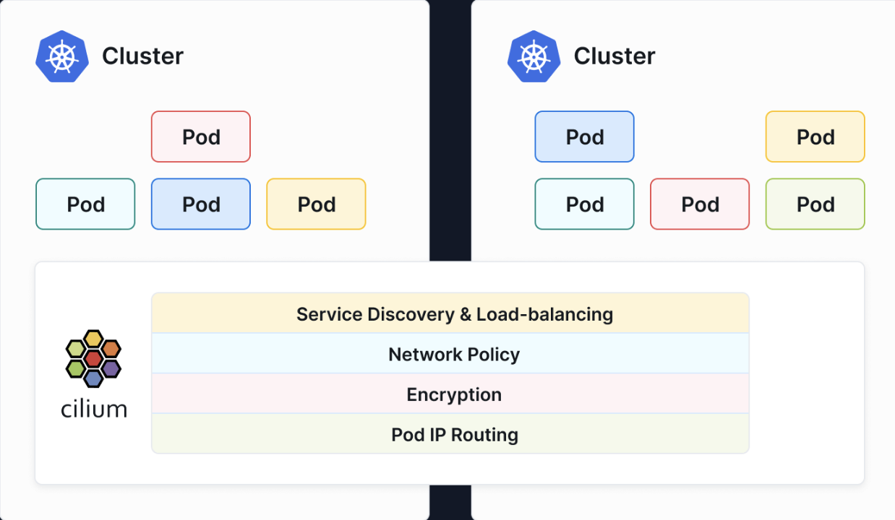

# aggrik8s-net/aggrik8s-cluster
This project spins up a development platform composed of [Talos Kubernetes clusters](https://www.talos.dev) meshed using [Cilium](https://cilium.io/use-cases/cluster-mesh/). 
<p align="center">
  
</p>
The next phase of the platform will focus on CI/CD and BGP based network infrastructure. 

## TLDR;
Talos and Cilium combined give us the ability to create Kubernetes platforms ready to monetize!

[Talos](https://github.com/siderolabs/talos) is an immutable Linux distribution purpose built to run Kubernetes.

[Cilium](https://github.com/cilium/cilium) is an [eBPF](https://ebpf.io/) based CNI which dramatically improves scalability, cost efficiency, and observability of the cluster.

We use a Terraform module [bbtechsys/terraform-proxmox-talos](https://github.com/bbtechsys/terraform-proxmox-talos) to spin up Proxmox based Talos clusters with CNI disabled (required to install Cilium).
The module uses the [bpg/terraform-provider-proxmox](https://github.com/bpg/terraform-provider-proxmox) provider to provision Talos VMs and the [siderolabs/terraform-provider-talos](https://github.com/siderolabs/terraform-provider-talos) provider to configure those VMs as our `control-plane` and `worker` nodes.
The stack uses [DopplerHQ/terraform-provider-doppler](https://github.com/DopplerHQ/terraform-provider-doppler) to create and inject secrets used by [hashicorp/terraform-provider-kubernetes](https://github.com/hashicorp/terraform-provider-kubernetes) to install k8s bits such as our Cilium CRD manifests and [hashicorp/terraform-provider-helm](https://github.com/hashicorp/terraform-provider-helm) for helm charts used to install resources such as `rook-ceph`.

We have verified the reusability of existing `Ansible Playbooks` to install `Day 2 Services` such as [Robusta](https://docs.robusta.dev/master/#), [Ollama](https://ollama.com) and [Honeycomb OTEL](https://docs.honeycomb.io/send-data/opentelemetry/collector/).

## Status
This recipe has been tested and verified to orchestrate the provisioning of our mesh of (two) Talos clusters.
1. [../bin/spinUp.sh](https://github.com/Aggrik8s-net/aggrik8s-cluster/blob/cilium/bin/spinUp.sh) provisions the Talos Clusters and sets up our Doppler secrets.
2. [../bin/getCreds.sh](https://github.com/Aggrik8s-net/aggrik8s-cluster/blob/cilium/bin/getCreds.sh) create local `talosconfig` and `kubeconfig` files and merge our `kubeconfig` files to support `kubectx -`.
3. `export KUBECONFIG=./tmp/kubeconfig` point to our merged `kubeconfig` file.
4. `mv rook-ceph.tf rook-ceph.tf-` disable `rook-ceph` provisioning until after Cilium is installed.
5. `doppler run --name-transformer tf-var -- terraform apply` installs our Kubernetes bits including CRD's we need to start Cilium.
6. [../bin/cilium-config.sh -i 1 -n talos-east -c admin@talos-east](https://github.com/Aggrik8s-net/aggrik8s-cluster/blob/cilium/bin/cilium_config.sh) install Cilium on `talos-east`.
7. [../bin/cilium-config.sh -i 2 -n talos-west -c admin@talos-west](https://github.com/Aggrik8s-net/aggrik8s-cluster/blob/cilium/bin/cilium_config.sh) install Cilium on `talos-west`.
8. `mv rook-ceph.tf- rook-ceph.tf` enable `rook-ceph` provisioning now that Cilium CNI is installed.
9. `doppler run --name-transformer tf-var -- terraform apply` installs our Kubernetes bits including CRD's we need to start Cilium.
10. ` cilium clustermesh enable --context admin@talos-east --service-type NodePort` enable 1/2 of our Cluster Mesh.
11. ` cilium clustermesh enable --context admin@talos-west --service-type NodePort` enable the other 1/2 of the Mesh. 

Both clusters are good to go. 
Our Cluster credentials for Talos and Kubernetes have been exported both as [Doppler secrets](https://www.doppler.com/integrations/kubernetes) and as local `talosconfig` and `kubeconfig` files. 
We are using the Cilium CLI to manage our environment because `Cilium Helm charts` do not always work correctly.
Our existing Ansible Playbooks have been verified to be reusable to configure `Day 2 Services` such as [Robusta](https://github.com/robusta-dev/robusta), [Honeycomb OTEL](https://docs.honeycomb.io/send-data/opentelemetry/).
SecOps is addressed using [Doppler](https://www.doppler.com/platform/secrets-manager) to manage our platform secrets (Proxmox, Terraform, linux, and Kubernetes) and tools such as [Kubescape](https://kubescape.io/) with [Armo](https://hub.armosec.io/docs/armo-platform#how-armo-platform-works) and [Groundcover](https://www.groundcover.com/ebpf-sensor).

## Example Cluster Mesh
We t this point we have two working Talos Clusters ready to mesh using Cilium, let's check `talos-east`.
#### $ kubectl get nodes -o wide
```
NAME            STATUS   ROLES           AGE   VERSION   INTERNAL-IP     EXTERNAL-IP   OS-IMAGE          KERNEL-VERSION   CONTAINER-RUNTIME
talos-038-r2y   Ready    <none>          42h   v1.32.0   192.168.10.60   <none>        Talos (v1.10.4)   6.12.31-talos    containerd://2.0.5
talos-lu9-i4w   Ready    <none>          42h   v1.32.0   192.168.10.59   <none>        Talos (v1.10.4)   6.12.31-talos    containerd://2.0.5
talos-nrn-yiw   Ready    control-plane   42h   v1.32.0   192.168.10.58   <none>        Talos (v1.10.4)   6.12.31-talos    containerd://2.0.5
talos-rvp-mr8   Ready    control-plane   42h   v1.32.0   192.168.10.62   <none>        Talos (v1.10.4)   6.12.31-talos    containerd://2.0.5
talos-vyf-fhz   Ready    control-plane   42h   v1.32.0   192.168.10.57   <none>        Talos (v1.10.4)   6.12.31-talos    containerd://2.0.5
talos-wiz-qp1   Ready    <none>          42h   v1.32.0   192.168.10.61   <none>        Talos (v1.10.4)   6.12.31-talos    containerd://2.0.5
```
Next we enable `clustermesh` mode using the following commands.
#### dshea@pi-manage-01:~/git/aggrik8s-cluster/terraform $ cilium clustermesh enable --context admin@talos-west --service-type NodePort
```⚠️  Using service type NodePort may fail when nodes are removed from the cluster!
```
#### dshea@pi-manage-01:~/git/aggrik8s-cluster/terraform $ cilium clustermesh enable --context admin@talos-east --service-type NodePort
```⚠️  Using service type NodePort may fail when nodes are removed from the cluster!
```
We check the Clustermesh status using the Cilium CLI.
#### dshea@pi-manage-01:~/git/aggrik8s-cluster/terraform $ cilium status
```
/¯¯\
/¯¯\__/¯¯\    Cilium:             OK                                                                                                                                                                                                                    
\__/¯¯\__/    Operator:           OK
/¯¯\__/¯¯\    Envoy DaemonSet:    OK
\__/¯¯\__/    Hubble Relay:       disabled
\__/       ClusterMesh:        OK

DaemonSet              cilium                   Desired: 6, Ready: 6/6, Available: 6/6
DaemonSet              cilium-envoy             Desired: 6, Ready: 6/6, Available: 6/6
Deployment             cilium-operator          Desired: 2, Ready: 2/2, Available: 2/2
Deployment             clustermesh-apiserver    Desired: 1, Ready: 1/1, Available: 1/1
Containers:            cilium                   Running: 6
cilium-envoy             Running: 6
cilium-operator          Running: 2
clustermesh-apiserver    Running: 1
hubble-relay             
Cluster Pods:          45/45 managed by Cilium
Helm chart version:    1.18.0-rc.0
Image versions         cilium                   quay.io/cilium/cilium:v1.18.0-rc.0@sha256:5e1cf48e1cce3ed7050f8238fb78f89f535b6baab00b03124c84f31ad1331ea2: 6
cilium-envoy             quay.io/cilium/cilium-envoy:v1.34.1-1750869463-42c7e8cf0f93ea19c9cb7e4d0ad2a339b3f81ad2@sha256:892cab92ffaf8499be90bd227bf07181e4b460ecd97750032ea7e91710a8acce: 6
cilium-operator          quay.io/cilium/operator-generic:v1.18.0-rc.0@sha256:6f8c73053cf94cc26c8f18e54dccb65a1305bf881ccbdeebcdd25e79faa0ac2e: 2
clustermesh-apiserver    quay.io/cilium/clustermesh-apiserver:v1.18.0-rc.0@sha256:1c39b242b24cd465e3ad5dc369ce24afd0dcc906a94657224dc44d07ef8642de: 3
```

## Purpose
The `aggrik8s-net/aggrik8s-cluster` stack gives us a Service Mesh Platform ready to host revenue generating applications.  
## Status
The Cilium branch works but has a race condition involving Kubernetes credentials. This requires multiple `terraform apply` runs and bash helper scripts to automate things not yet terraformed. The stack does export the correct Talos and Kubernetes credentials for each cluster (after it is created) but, because the credentials were not known at plan time, the KUBECONFIG related bits will fail until we run `bin/getCreds.sh` to set up our cluster's KUBECONFIG and TALOSCONFIG files. At this point, we use `talosctl wipe disk vdb` to insure that the second disk on our worker nodes is wiped of partitions to prepare it for use by `rook-ceph`. Another `terraform apply` will successfully connect to our clusters and use `kubectl` & `Helm` to configure our K8s bits. We now have two working clusters, `talos-east` and `talos-west` with all nodes in `NotReady` status as required to install Cilium. Next, run `bin/cilium_config.sh` to install Cilium CNI and bring all nodes `Ready`. We use the Cilium CLI because `Cilium Helm charts` do not handle certain scenarios properly, the CLI always works. Hubble, Robusta, Rook-Ceph, Honeycomb OTEL, and several other Day-2 applications have been verified to work on the meshed clusters.
We are using [Doppler](https://www.doppler.com/platform/secrets-manager) to manage Proxmox, Terraform, and Kubernetes secrets. and have wired `aggrik8s-net/aggrik8s-cluster` into [aikido Security Scanner](https://www.aikido.dev/) and are using [Kubescape](https://kubescape.io/) with [Armo](https://hub.armosec.io/docs/armo-platform#how-armo-platform-works) for SecOps controls.
## Design
We use Terraform to provision Cilium Mesh of Talos based Kubernetes clusters.
- We spin up Kubernetees clusters using [bbtechsys/talos/proxmox"](https://registry.terraform.io/modules/bbtechsys/talos/proxmox/latest) which uses:
  - Proxmox VMs are provisioned using [bgp/terraform-provider-proxmox](https://github.com/bpg/terraform-provider-proxmox),
  - Talos nodes and clusters managed using [siderolabs/talos Terraform provider](https://registry.terraform.io/providers/siderolabs/talos/0.9.0-alpha.0).
  - Talos `Image Factory` generation of `control-plane` and `worker-node` configurations are patched to handle our requirements.
- [DopplerHQ/doppler](https://registry.terraform.io/providers/DopplerHQ/doppler/latest/docs) manages Secrets for Terraform and Kubernetes,
- CSI ObjectSore, BlockStore, and FileSystem services using [rook-ceph on Talos](https://www.talos.dev/v1.10/kubernetes-guides/configuration/ceph-with-rook/) and [digitalocean/csi-digitalocean](https://github.com/digitalocean/csi-digitalocean),
- CNI wired up following [Cilium on Talos](https://www.talos.dev/v1.10/kubernetes-guides/network/deploying-cilium/) provides Cilium features, 
- Ansible Playbooks for Day-2 services such as `Honeycomb OTEL`, `Robusta`, `OLMv1` will be merged into the stack over time.
## Telemetry
- Hubble for network traffic analysis (see IP .
- Tetragon for SecOps (see system calls)
- Robusta for Cloud based Cluster DevOps workflows.
- `Groundcover` for Inversion of Cost for OTEL Cloud storage. They only ingest metadaata, all actual OTEL data remains in cluster.
## Applications
- Ollama
- 
## Status
The Cilium branch works but requires at least two `terraform apply` and several bash helper scripts for setting up Talos & Kubernetes credentials as well as installing Cilium. 
The stack will be fully automated once the best integration strategy is determined. For instance, Helm can be usind to install Cilium or we can use the Cilium CLI which properly handles complicated scenarios not properly handled using Helm.

